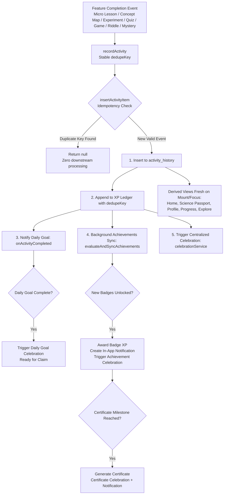

# Vigyaan Mobile: Cross-Feature Architecture Guide

## Phase 54: Full Cross-Feature Integration

This document defines the unified, deterministic, and idempotent architecture governing how all features across the Vigyaan / VigyaanXpo React Native mobile application communicate through shared domain services, canonical activity events, progress, rewards, achievements, navigation, celebrations, and user session state.

---

## 1. Architectural Principles

1. **Single Source of Truth**: Each domain quantity (XP, streaks, activity history, daily goals, achievements, certificates) is owned by exactly one repository. Derived views (Home, Science Passport, Profile, Progress, Explore) read from these canonical stores and never maintain conflicting duplicate counters.
2. **Deterministic Event Pipeline**: All student completions emit a typed canonical `ActivityEventInput` with a deterministic, stable `dedupeKey`. Screen remounts, rapid taps, and app restarts never double-reward XP or duplicate state.
3. **Resilient Downstream Dispatch**: When an activity is recorded, secondary consumers (Daily Goal, Achievements, Celebrations, Notifications) run in safe, isolated handlers (`try/catch`). Failure in a secondary listener never compromises or rolls back the student's core completion and XP record.
4. **Protected Core Learning & Quizzes**: Learn content, Quiz engines, scoring, timers, hint mechanics, and question models remain 100% untouched and protected.
5. **Zero Backend / Zero Fake AI**: The entire system operates synchronously and offline-first on the student's device using high-performance in-memory cached storage.

---

## 2. Source-of-Truth Matrix

| Domain | Source of Truth | Primary Storage Key | Read By | Written By |
| :--- | :--- | :--- | :--- | :--- |
| **Session** | `SessionRepository` | `@vigyaan/auth_session` | App Shell, Profile, Home, Passport | `authService.login`, `authService.logout` |
| **Profile** | `storage` | `@vigyaan/student_profile` | Profile, Home, Passport, Certificates, Progress | Profile Setup, Edit, `authService.logout` (cleared) |
| **Activity History** | `activity.storage.ts` | `@vigyaan/activity_history` | Home, Passport, Profile, Progress, Streaks, Achievements, Missions | `recordActivity` (canonical orchestrator) |
| **XP / Ledger** | `xp.storage.ts` | `@vigyaan/xp_transactions` | Profile, Passport, Home, Rewards | `recordXp` (via `recordActivity`, mission claims) |
| **Streak** | `streaks.service.ts` | Derived from activity history | Home, Passport, Profile, Streak Screen | Computed dynamically via `calculateStreak` |
| **Progress** | `progress.service.ts` | Aggregated domain progress | Progress Screen, Home | Domain stores (`microLessons`, `conceptMaps`, `experiment`, `quiz`) |
| **Daily Goal** | `dailyGoal.storage.ts` | `@vigyaan/daily_goal_state` | Home, Daily Goal Screen, Missions | `dailyGoalService.onActivityCompleted`, `claimDailyGoalReward` |
| **Achievements** | `achievements.storage.ts` | `@vigyaan/achievements_unlocked` | Home, Passport, Profile, Achievements Screen | `evaluateAndSyncAchievements` |
| **Collections** | `sciencePassport.collectionHelpers.ts` | `@vigyaan/collections_progress` | Home, Passport, Explore | Collection helpers / discovery evaluation |
| **Certificates** | `certificates.storage.ts` | `@vigyaan/certificates_earned` | Home, Passport, Profile, Certificates Screen | `recomputeAndPersistCertificates` |
| **Notifications** | `notifications.factory.ts` | `@vigyaan/notification_inbox` | Notifications Screen, Header bell, Profile badge | `createNotification` (deduplicated by stable ID) |
| **Celebrations** | `celebration.service.ts` | `@vigyaan/celebration_state` | `CelebrationOverlay` (in `AppShell`) | `celebrationService.trigger*` (with deduplication) |
| **Favorites** | `explore.storage.ts` | `@vigyaan/explore_favorites` | Explore, Search | `toggleFavorite` |
| **Recent Activity** | `activity.storage.ts` | `getRecentActivity(limit)` | Home, Profile, Rewards | `recordActivity` |

---

## 3. Canonical Event Flow Diagram



---

## 4. Feature Completion & Dedupe Key Standards

| Feature | Event Type (`ActivityEventType`) | Canonical Dedupe Key Format | XP Awarded | Downstream Actions |
| :--- | :--- | :--- | :--- | :--- |
| **Micro Lesson** | `micro_lesson_completed` | `micro-lesson-${lesson.id}` | +20 XP | Daily Goal +1, Achievements check, Lesson Celebration |
| **Concept Map** | `concept_map_completed` | `concept-map-${map.id}` | +10 XP | Daily Goal +1, Achievements check, Concept Map Celebration |
| **Experiment Lab** | `experiment_completed` | `experiment:${experiment.id}` | +25 XP | Daily Goal +1, Achievements check, Experiment Celebration |
| **Quiz** | `quiz_completed` | `quiz-${entry.id}` | +25 XP | Daily Goal +1, Streak check, Achievements check, Result Screen |
| **Game Level** | `game_completed` | `game:${gameId}:${levelId}:completed` | +20 XP | Daily Goal +1, Next Level Unlock, Personal Best check |
| **Riddle Set** | `riddle_completed` | `riddle-${difficulty}-${completedAt}` | +15 XP | Daily Goal +1, Achievements check, Riddle Celebration |
| **Mystery Lab** | `mystery_completed` | `mystery:${caseId}` | +30 XP | Daily Goal +1, Achievements check, Mystery Celebration |
| **Daily Goal Claim** | `mission_completed` | `daily-goal-claim-${dateKey}` | 0 XP (XP in reward) | Mission record, Points ledger |
| **Achievement** | `achievement_unlocked` | `achievement-${badgeId}` | +40-100 XP | Notification created, Achievement Celebration, Certificate check |
| **Certificate** | `certificate_earned` | `certificate-${certificate.id}` | +60 XP | Notification created, Certificate Celebration |

---

## 5. Idempotency & Deduplication Engine

1. **Storage Idempotency**:
   `insertActivityItem` prefixes the dedupe key with `act-` (e.g. `act-game:zip:zip-01:completed`). If an item with this ID is already in the history, `insertActivityItem` immediately returns `null`.
2. **Ledger Idempotency**:
   `recordXp` uses the identical dedupe key. If `xp_transactions` already contains a transaction with this dedupe key, no new XP transaction is inserted.
3. **Notification Idempotency**:
   `createNotification` accepts an optional `id` parameter (e.g. `notif-achieve-first_quiz`). If this notification ID exists in `notification_inbox`, the notification is dropped.
4. **Celebration Idempotency**:
   `celebrationService` computes a unique event key and tracks handled keys in both an in-memory set and persistent storage (`@vigyaan/celebration_state`). Handled celebrations are never replayed on restart or remount.
5. **Streak Idempotency**:
   `calculateStreak` normalizes all activity timestamps to local calendar date strings (`YYYY-MM-DD`). Multiple activities on the same date count as a single active day.

---

## 6. Centralized Celebration Architecture

Rather than each feature instantiating its own modals, all celebration events route through `celebrationService` and render via `<CelebrationOverlay>` mounted at the root in `AppShell.tsx`:
- **Subtle (Toasts)**: Micro lessons, concept maps, experiments, game levels, riddles.
- **Standard (Modals)**: Achievement unlocks, daily goal completion, personal bests.
- **Major (Confetti + Modal)**: Certificates, major level milestones, streak milestones.
- **Respects User Settings & Reduced Motion**: Automatically checks reduced motion flags and celebration intensity settings.

---

## 7. Session Isolation & Logout Hygiene

When `authService.logout()` is called:
1. `SessionRepository.clearSession()` revokes the active user session.
2. All student-specific stores are wiped:
   - Profile & Setup flags (`STUDENT_PROFILE`, `STUDENT_PROFILE_SETUP_COMPLETE`)
   - Activity history (`ACTIVITY_HISTORY`)
   - XP ledger (`XP_TRANSACTIONS`)
   - Daily goal state (`DAILY_GOAL_STATE`)
   - Achievements unlocked (`ACHIEVEMENTS_UNLOCKED`)
   - Certificates earned (`CERTIFICATES_EARNED`)
   - Notifications inbox (`NOTIFICATION_INBOX`)
   - Games progress, streaks, badges (`GAMES_PROGRESS`, `GAMES_STREAK`, `GAMES_BADGES`)
   - Quiz history (`QUIZ_HISTORY`)
   - Micro lessons, concept maps, experiment progress
   - Mystery lab, riddles progress
   - Celebration state (`CELEBRATION_STATE`)
   - Explore favorites & recently viewed (`EXPLORE_FAVORITES`, `EXPLORE_RECENTLY_VIEWED`)
   - Dashboard cache (`DASHBOARD_CACHE`)
3. **Preserved Device Preferences**:
   - `USER_LANGUAGE`
   - `HAS_LAUNCHED_BEFORE`
   - `ONBOARDING_COMPLETED`
   - `APP_SETTINGS`
4. The router calls `router.replace('/auth-welcome')`, ensuring the back stack cannot return to authenticated screens.

---

## 8. Backend Handoff Contracts (Future Implementation)

When migrating from local storage to a live backend, the following REST/GraphQL endpoints map 1:1 to the local architecture:

### 1. Activity Ingestion API
- **Endpoint**: `POST /v1/activity/events`
- **Request Body**:
  ```json
  {
    "type": "micro_lesson_completed",
    "dedupeKey": "micro-lesson-phys-001",
    "title": "Laws of Motion",
    "xpEarned": 20,
    "metadata": { "subject": "physics", "durationMinutes": 3 },
    "occurredAt": "2026-09-06T11:15:00Z"
  }
  ```
- **Response**: `200 OK` (processed) or `200 OK` (idempotent duplicate skipped).

### 2. XP & Ledger API
- **Endpoint**: `GET /v1/xp/balance` -> `{ "totalXp": 450, "level": 4 }`
- **Endpoint**: `GET /v1/xp/transactions?limit=20` -> List of ledger entries.

### 3. Daily Goal API
- **Endpoint**: `GET /v1/daily-goals/today` -> Today's goal, target, completed activities, and claim status.
- **Endpoint**: `POST /v1/daily-goals/claim` -> Idempotent reward claim.

### 4. Streak API
- **Endpoint**: `GET /v1/streaks/summary` -> `{ "currentStreak": 5, "longestStreak": 12, "activeDates": [...] }`

### 5. Achievements & Certificates API
- **Endpoint**: `GET /v1/achievements` -> Badges list with unlock status and progress.
- **Endpoint**: `GET /v1/certificates` -> List of earned certificates with verification numbers (`VIG-YYYY-XXXX`).

### 6. Notifications API
- **Endpoint**: `GET /v1/notifications/inbox` -> List of in-app notifications.
- **Endpoint**: `POST /v1/notifications/:id/read` -> Mark read.
